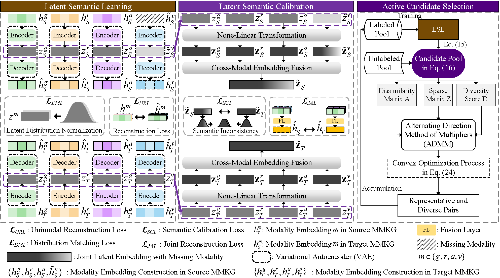

# ALMEA: Active Learning-Enhanced Multimodal Entity Alignment with Semantically-Calibrated Modality Imputation

This repository contains the implementation of our method proposed in the NeurIPS 2025 submission titled "ALMEA: Active Learning-Enhanced Multimodal Entity Alignment with Semantically-Calibrated Modality Imputation".

> **Note**: This repository is anonymous and intended solely for the purpose of double-blind peer review.

> Multimodal knowledge graphs (MMKGs) offer enriched knowledge representation by integrating structural, visual, and textual information from heterogeneous sources. However, existing multimodal entity alignment (MMEA) approaches face significant challenges due to missing modalities and semantic inconsistencies across sources. These limitations compromise alignment robustness, especially in low-resource scenarios with limited seed pairs. To bridge the gap, we propose \textbf{ALMEA}, a novel MMEA framework that integrates semantic calibration and active learning to improve alignment. Specifically, ALMEA synthesizes embeddings for missing modalities and refines semantic representations to address inconsistencies across MMKGs. With active learning strategy, it iteratively selects optimal candidate pairs within a learnable budget, enabling more effective acquisition of modality information in low-resource scenarios. Extensive experiments on benchmark MMKG datasets demonstrate that ALMEA consistently outperforms state-of-the-art baselines, achieving an MRR improvement of approximately 4.70\%. The effectiveness of the semantic calibration was also confirmed by the non-active variant in the ablation study, with accuracy improvements of 2.02\% and 2.85\%.
<p align="center">
  
</p>

## 🔧 Environment Setup

We provide a `requirements.txt` file for setting up the Python environment. Below are the main dependencies used in this project:

```bash
pip install -r requirements.txt
```

## 📦 Details

- Python (>= 3.9)
- [PyTorch](https://pytorch.org/) (~= 2.5.1 + cu121)
- [NumPy](https://numpy.org/) (~= 2.2.1)
- [Transformers](https://huggingface.co/transformers/) (~= 4.47.1)
- [TQDM](https://tqdm.github.io/) (~= 4.66.4)
- [SciPy](https://scipy.org/) (~= 1.14.1)
- [Seaborn](https://seaborn.pydata.org/) (~= 0.13.2)
- [Matplotlib](https://matplotlib.org/) (~= 3.10.0)
- [Scikit-learn](https://scikit-learn.org/) (~= 1.5.2)
- [Pandas](https://pandas.pydata.org/) (~= 2.2.3)
- [EasyDict](https://pypi.org/project/easydict/) (~= 1.13)
- [Unidecode](https://pypi.org/project/Unidecode/) (~= 1.3.8)
- 
## 📚 Dataset

- ❗**Note**: Download the dataset from [Google Drive (0.93 GB)](https://drive.google.com/file/d/1cX1LEMwECwsadmBc3iMu5LTUS5wlwZ30/view?usp=sharing) and unzip it to match the following directory structure:
```text
ROOT/
├── data/
│   └── mmkg/
└── code/
    └── ALMEA/
```

- 🧾 **Optional**: Raw **Relations** & **Attributes** from DBP15K and MEAformer case study can be downloaded from [HuggingFace (150 MB)](https://huggingface.co/datasets/HackCz/DBP15K_raw/blob/main/DBP_raw.zip).

- 🖼️ **Optional**: Raw **entity images** from DBP15K can be downloaded from [Baidu Cloud Drive (~50 GB)](https://pan.baidu.com/s/1nRpSLJtTUEXDD4cgfSZZQQ) with extraction code: `mmea`.

<details>
  <summary>📌 Accessing Entity Images via Pickle</summary>

```python
import pickle
zh_images = pickle.load(open("eva_image_resources/dbp15k/zh_dbp15k_link_img_dict_full.pkl", 'rb'))
print(zh_images["http://zh.dbpedia.org/resource/香港有線電視"].size)
```
</details>

## 📦 Code Structure

<details>
  <summary>👈 🔎 Click</summary>

```text
ALEA/
├── picture/
├── src/
│   ├── data_processing/
│   │   ├── __init__.py
│   │   ├── data.py
│   │   ├── distributed_utils.py
│   │   ├── tensorBoardManager.py
│   │   └── utils.py
│   ├── pre_train_models/
│   │   ├── __init__.py
│   │   ├── GNN_tools.py
│   │   ├── layers.py
│   │   ├── MCLEA.py
│   │   ├── MCLEA_loss.py
│   │   ├── MCLEA_tools.py
│   │   ├── RANKER.py
│   │   └── Tool_model.py
│   ├── torchlight/
│   │   ├── __init__.py
│   │   ├── logger.py
│   │   ├── metric.py
│   │   └── utils.py
│   ├── __init__.py
│   ├── ACS_ADMM.py
│   ├── almea.py
│   └── Semantic_Calibration_KL.py
├── config.py
├── main.py
├── README.md
├── requirements.txt
├── run.sh
└── run_experiments.sh
```
</details>

## Data Path

<details>
  <summary>👈 🔎 Click</summary>

```text
mmkg
├── DBP15K
│   ├── fr_en
│   │   ├── ent_ids_1
│   │   ├── ent_ids_2
│   │   ├── ill_ent_ids
│   │   ├── training_attrs_1
│   │   ├── training_attrs_2
│   │   ├── triples_1
│   │   └── triples_2
│   ├── ja_en
│   │   ├── ent_ids_1
│   │   ├── ent_ids_2
│   │   ├── ill_ent_ids
│   │   ├── training_attrs_1
│   │   ├── training_attrs_2
│   │   ├── triples_1
│   │   └── triples_2
│   ├── translated_ent_name
│   │   ├── dbp_fr_en.json
│   │   ├── dbp_ja_en.json
│   │   └── dbp_zh_en.json
│   └── zh_en
│       ├── ent_ids_1
│       ├── ent_ids_2
│       ├── ill_ent_ids
│       ├── training_attrs_1
│       ├── training_attrs_2
│       ├── triples_1
│       └── triples_2
├── FBDB15K
│   └── norm
│       ├── ent_ids_1
│       ├── ent_ids_2
│       ├── ill_ent_ids
│       ├── training_attrs_1
│       ├── training_attrs_2
│       ├── triples_1
│       └── triples_2
├── FBYG15K
│   └── norm
│       ├── ent_ids_1
│       ├── ent_ids_2
│       ├── ill_ent_ids
│       ├── training_attrs_1
│       ├── training_attrs_2
│       ├── triples_1
│       └── triples_2
├── embedding
│   └── glove.6B.300d.txt
├── pkls
│   ├── dbpedia_wikidata_15k_dense_GA_id_img_feature_dict.pkl
│   ├── dbpedia_wikidata_15k_norm_GA_id_img_feature_dict.pkl
│   ├── FBDB15K_id_img_feature_dict.pkl
│   ├── FBYG15K_id_img_feature_dict.pkl
│   ├── fr_en_GA_id_img_feature_dict.pkl
│   ├── ja_en_GA_id_img_feature_dict.pkl
│   └── zh_en_GA_id_img_feature_dict.pkl
├── MEAformer
└── dump
```
</details>

⚠️ **Note**:  
Our experiments in this work are conducted exclusively on **FBDB15K** and **FBYG15K**.  
We deliberately exclude **DBP15K** (*fr_en*, *ja_en*, *zh_en*) due to potential surface form leakage,  which may lead to unreliable or overestimated results. To ensure fair and trustworthy evaluation, we therefore abandon DBP15K in our main experimental analysis.

## 💡 Acknowledgement

We appreciate the following open-source projects for their contributions to the field of multimodal and entity alignment research, which have inspired and facilitated our work:

- [MCLEA](https://github.com/lzxlin/MCLEA)
- [MSNEA](https://github.com/liyichen-cly/MSNEA)
- [EVA](https://github.com/cambridgeltl/eva)
- [MMEA](https://github.com/liyichen-cly/MMEA)
- [MEAformer](https://github.com/ZJLAB-AMMI/MEAformer)
- [GEEA](https://github.com/ZJLAB-AMMI/GEEA)

We sincerely thank the authors of these projects for their open-source contributions.

